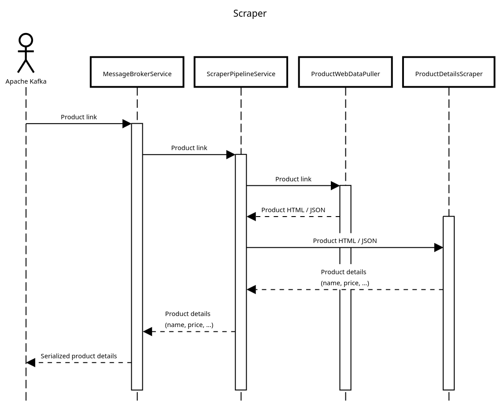

# Scraper

Приложение, отвечающее за получение "полезных" данных о товаре (таких, как, например, название товара, цена на товар и
т. д.) по ссылке на этот товар на маркетплейсе.

Диаграмма последовательности выглядит следующим образом:


1. Ссылка на товар приходит из брокера сообщений и попадает в метод `consume` класса `MessageBrokerService`.
2. Далее запускается процесс обработки этой ссылки, за который отвечает класс `ScraperPipelineService`.
3. Сперва ссылка передается методу `get_web_data` класса `ProductWebDataPuller`, который по ссылке на товар получает
   из маркетплейса HTML страницу (или JSON) с информацией о товаре.
4. Далее полученные данные передаются в метод `get_details` класса `ProductDetailsScraper`, который по HTML разметке
   (или JSON-у) получает "полезную" информацию о товаре (такую, как, например, название товара, цена на товар и т. д.).
5. Эти "полезные" данные, сериализованные в JSON, передаются методом `__produce` класса `MessageBrokerService` через
   брокер сообщений в другое приложение.

## Использование

1. Для запуска приложения вручную нужно, находясь в корневой директории проекта, установить переменную окружения
   `PYTHONPATH`, которая используется для определения, где искать модули при импорте:
```shell
export PYTHONPATH=.:$PYTHONPATH
```
2. Далее можно запускать само приложение:
```shell
python3 scraper/main.py
```
